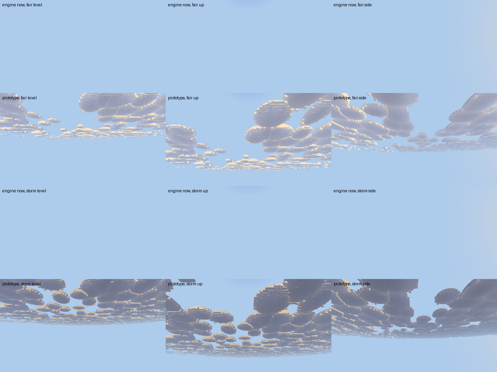
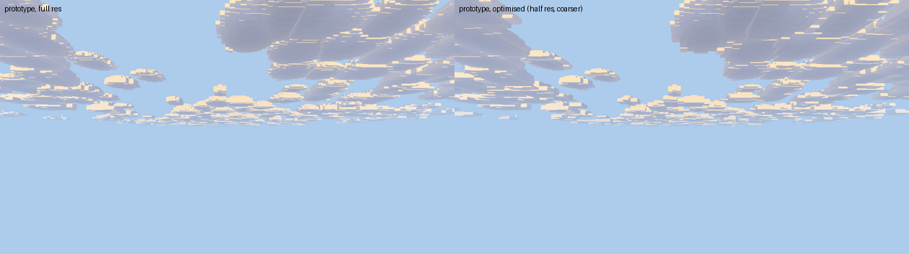
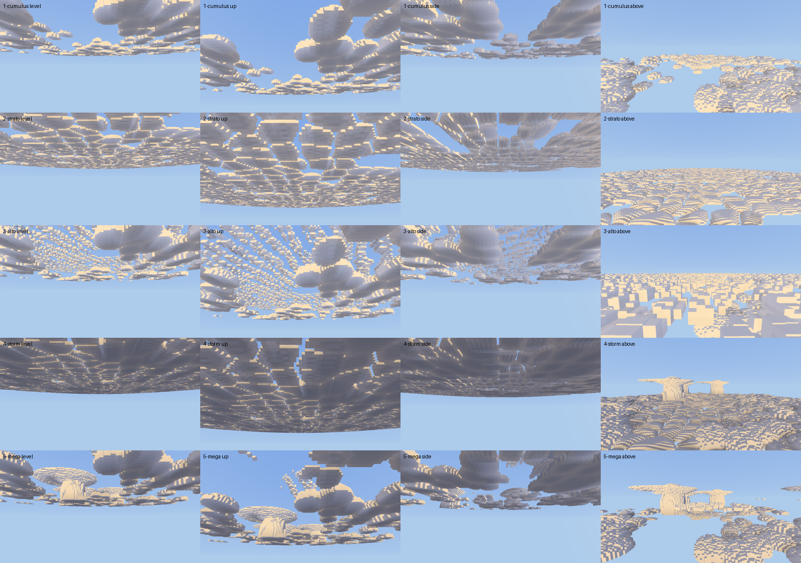

# Engine asks from Tiamat Weather

From the `tiamat_weather` mod (repo `Tiamat_Default_Weather`, beside the
engine checkout). Kept here, in the engine's `docs/engine-asks/`, so the
engine agent finds every mod's asks in one place and they are versioned with
the engine. Pictures and patches an ask cites are in `tiamat_weather/` beside
this file; W12's are kept there as the record of engine 0d8e857.

Numbered W*n*, continuing the weather sheet: W1–W9 were filed in that repo's
`docs/engine-asks-weather.md` and all of them are built or answered. That
file stays as the history. Each entry says what was seen, why the mod cannot
fix it, and the smallest engine change that would. Newest first. Items are
removed when they land.

## W15. The deck is erased by the world's fog, and its bases are a crop (2026-09-22)

**Seen, in game, by the designer.** "The fog is making it so they are only an
outline. Not really any detail is seen." And: the bottoms are "such a sharp
flat crop", and the shapes want more variation. And an optimisation pass.

**The first is a bug, and it is the whole of the "outline".** In mode 3 the
post pass fogs every pixel by its DEPTH against `sky.w`, the terrain's view
distance — a few hundred blocks. The deck stands hundreds of blocks up and
runs to the horizon, so every cloud pixel is past that and `haze` saturates:
the deck is replaced by flat sky, whatever it was. `clouds.wgsl` then fogs
AGAIN on its own, against the same `sky.w`, so modes 1 and 2 wash out too.
Rendered with the fog a player actually has (`set_sky(sky, 256)`), the sky
is empty:



Top and third rows: engine 9c4e120 at a 256-block view distance, fair and
storm — the deck is gone. Second and fourth: the prototype. The harness's
own default was `100_000`, which is why no cloud test has ever shown this.

### The ask

1. **A cloud pixel is not fogged as terrain.** Cloud is seen through air, not
   through the terrain's fog, and it carries its own aerial perspective. In
   the prototype the cloud pass marks its hits (alpha 0 — the pass is opaque,
   so it can write alpha and replace rather than blend) and the post pass
   leaves those pixels alone. A stencil bit or a second target would do as
   well; what matters is that the post fog can tell. **Its own haze**, in
   `clouds.wgsl`, is then against the deck's own reach (`quality.x`) rather
   than `sky.w`, and capped at 0.7 — cloud never loses all its contrast.
2. **A base is flat per HEAP, not per deck.** One plane sheared through every
   cloud in the sky is the crop. Each heap sits at its own level (a hash,
   ±0.15 of the thickness), its underside lifts towards its own rim
   (`0.10 * rim^2`), and the small scale ruffles it near the camera. None of
   it is a function of the field, so the terracing W12 removed cannot return.
3. **A heap is not a circle and not the same dome as its neighbour.** One
   more hash per candidate gives a long axis (`stretch`, ±20 %), its own
   crown exponent (`pow(1 - d^2, 0.34..0.64)`, so some are pancakes and some
   are towers) and its own height. This is where the variation lives; another
   octave of noise would not do it.

### The optimisation pass

Measured at 1920 x 1080, Beautiful, Normal quality, Weather's deck, in the
same harness. A bare sky is 1.70 ms; the numbers below are the DECK's own
cost above that, in the four views:

| | level | up | side | above |
|---|---|---|---|---|
| prototype, as first written | 1.50 | 2.06 | 1.77 | 2.15 |
| + shadow cull, + cell rejection | 1.35 | 1.78 | 1.58 | 1.90 |
| + pixel target 9, + half-res Normal | 1.13 | 1.56 | 1.33 | 1.58 |

- **The self-shadow is six field lookups per cloud pixel**, and it is depth
  rather than detail: past a kilometre it moves a pixel or two of grey. Faded
  with distance and skipped beyond twice the detail reach.
- **A candidate cell that cannot reach the column is rejected before it is
  hashed.** The nearest corner of the cell against the widest a heap can be:
  two subtractions against a hash's four rounds, over nine cells, in both the
  heap search and the detail search.
- **The pixel target from 6 to 9** and **Normal at half resolution** are the
  designer's own call ("I'd be fine with them being lower resolution too")
  and are the biggest of the three. The pair is pictured — they are hard to
  tell apart at a glance:

  

The patch with all of it is
`tiamat_weather/cloud-fog-shape-prototype-2026-09-22.patch`, against
9c4e120. As always: a sketch to measure against, not a patch to merge. It
does not touch W13's genera, which are still open and still wanted.

**Acceptance.** At a 256-block view distance in every lighting mode, a
screenshot of the deck shows cubes, shading and the sun's edge — not a
silhouette. The bases of a bank sit at different levels and lift at their
rims. Two heaps beside each other differ in outline and in crown. The deck's
own cost does not rise over what it is today.

## W13. Cloud genera: cumulus, stratocumulus, altocumulus, cumulonimbus (2026-09-19, revised)

**Revised the same day, before any of it was built.** The first version
asked for three kinds (fair, storm, mega storm). The designer then asked
for more: the heaps are "pretty undetailed noise-wise", and the sky wants
"somewhat realistic shapes like stratocumulus, altocumulus and cumulonimbus
approximations". This replaces it. The first version's pictures and patch
stay in `tiamat_weather/` (`cloud-kinds-*`) as the record.

**Why the mod cannot.** The deck's shape is registration-only, one shape
for the whole world; per player `set_clouds` moves `cover`, `darkness` and
`base`. A sheet of stratocumulus, a mackerel sky and an anvil are shapes,
and none of them can be sent.

**Evidence.** A prototype of `clouds.wgsl` against c160b05, rendered in the
screenshot harness (a temporary ignored test, since removed), 960 x 540,
Beautiful, Normal quality, Weather's deck (cell 16, thickness 160, 1/500,
towers 0.2), base 400 over the camera:



Rows: fair cumulus (cover 0.45); stratocumulus (0.75, darkness 0.15);
altocumulus over a few cumulus (0.8 and 0.2); a storm (stratocumulus 0.85,
cumulonimbus 0.6, cumulus 0.2, darkness 0.7); a mega storm (cumulonimbus 1
among cumulus, stratocumulus and altocumulus at 0.3, darkness 0.6).
Columns: level, 30 degrees up, level and turned 90 degrees, and from 480
blocks over the base. The patch is
`tiamat_weather/cloud-genera-prototype-2026-09-19.patch`: a sketch to
measure against, not a patch to merge. The three new numbers ride in
`view.yzw` from an environment variable; the real thing wants them in
`Clouds`.

Frame time with the deck, ms, this machine's adapter (a bare sky is 0.6 to
0.8):

| | level | up | side | above |
|---|---|---|---|---|
| cumulus | 1.09 | 1.10 | 0.93 | 1.19 |
| stratocumulus | 0.78 | 0.81 | 0.78 | 0.94 |
| altocumulus | 1.50 | 1.96 | 1.48 | 1.82 |
| storm | 1.53 | 1.93 | 1.57 | 11.27 |
| mega storm | 2.81 | 4.19 | 2.72 | 10.90 |

From the ground everything is within about twice today's deck. From above
a cumulonimbus sky is the expensive one: the slab is a kilometre tall and
every pixel marches it. A separate, tighter bound for the anvils (they are
few and their lattice is known) would bring that down.

### The ask

**Per-player cover per genus, on `set_clouds`, eased with the rest:**

```lua
game.set_clouds(uuid, {
    cover = 0.2,            -- cumulus, as today
    stratocumulus = 0.85,   -- 0..1, default 0
    altocumulus = 0.0,      -- 0..1, default 0
    cumulonimbus = 0.6,     -- 0..1, default 0; at 1, supercells
    darkness = 0.7,
    ease_ticks = 600,
})
```

Numbers, so a front arriving blends one sky into the next. `cover` keeps
meaning cumulus, so a mod written for today's deck is unchanged.

**What each genus is in the prototype:**

- **Every top gets a rind:** about one small cube of low-frequency value
  noise (7 cycles per field unit), near the camera only. At the frequency
  first tried (22) it turned every crown to confetti at 16-block cubes;
  lower and gentler reads as lumps.
- **Cumulus:** W12's heaps, as a bun (`pow(1 - d^2, 0.4)`, fuller over the
  crown than a hemisphere), with florets from Worley cells a third of a
  heap across (`F2 - F1`, rounded) riding the crown and fading at the rim.
- **Stratocumulus:** low and thin (a third of the deck's thickness). Worley
  cells drawn out into rolls across the wind (0.46 by 0.27 field units,
  about 230 by 135 blocks on Weather's deck, so each cell spans a dozen
  cubes and can be round), in patches; each cell a rounded cushion, with
  grooves of sky between that close as cover rises. The cells must be many
  cubes wide: at a quarter this size they were confetti.
- **Altocumulus:** a mid-level layer (2.4 times the deck's thickness over
  the base) of small cloudlets (Worley cells about 70 blocks), lined up in
  wave bands the way a mackerel sky is, in patches. Lens-shaped: they grow
  up more than down. This is the one that needs **a third interval**
  (`Column.mid`), since it can sit under an anvil and over a heap in one
  column. It is also the one the cube size limits most: from the ground it
  reads as a dappled sheet, from above as tiles. A finer grid for this
  layer alone would help; an 8-block grid for the whole deck did not, much.
- **Cumulonimbus:** W13's first-version tower and anvil, on a lattice seven
  heaps wide, more of them and larger as the value rises (at 1, supercells
  of 880 blocks with mammatus). Florets from larger Worley cells on the
  tower's flanks. The anvil's top now thins to nothing at its rim instead
  of ending in a sheer edge.
- **Storm light:** `darkness` weighted by height through the cloud (`1 -
  0.6 * rel`), so bases are darkest and tops keep their sun.

### What Weather does once it lands

Clear: a few cumulus, some altocumulus. Cloudy: cumulus, stratocumulus and
altocumulus. Rain and snow: a thick stratocumulus sheet. Storm and blizzard:
stratocumulus under cumulonimbus. Mega storm (twice a year, built in
Weather 03f1925): cumulonimbus 1.

**Acceptance.** In the harness's four views: a stratocumulus sheet of
rounded cells with sky between; altocumulus as banded cloudlets from the
ground; a cumulonimbus reading as a tower under a spreading anvil; crowns
lumpy rather than smooth arcs. From the ground no genus costs more than
twice today's deck.

## W11. Cloud shadows on the ground (deferred from W2, 2026-09-18)

**Seen.** The deck drifts overhead, but the ground under a cloud is lit
exactly as the ground under clear sky. A patch of shade moving over a
hillside is most of what makes a drifting sky read as drifting from the
ground, and it is in the designer's references (`docs/reference/` in the
weather repo).

**Why the mod cannot.** The deck is marched on the client from a field the
mod never sees, and the sunlight on terrain is the client's own. The mod has
no per-pixel say in either.

**Smallest change.** In the terrain pass, one sample of the same cloud field
along the sun direction from each lit fragment, darkening the sun term by the
deck's density there. Mode 1 can skip it, as it skips other lighting.

**Deferred by agreement** when W2 was built. Filed here so it is not lost;
it is lower priority than W10 and W13.
