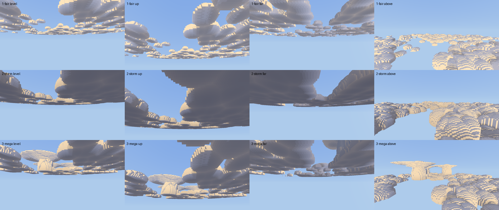

# Engine asks from Tiamot Weather

From the `tiamot_weather` mod (repo `Tiamot_Default_Weather`, beside the
engine checkout). Kept here, in the engine's `docs/engine-asks/`, so the
engine agent finds every mod's asks in one place and they are versioned with
the engine. Pictures and patches an ask cites are in `tiamot_weather/` beside
this file; W12's are kept there as the record of engine 0d8e857.

Numbered W*n*, continuing the weather sheet: W1–W9 were filed in that repo's
`docs/engine-asks-weather.md` and all of them are built or answered. That
file stays as the history. Each entry says what was seen, why the mod cannot
fix it, and the smallest engine change that would. Newest first. Items are
removed when they land.

## W13. Three kinds of cloud: fair weather, storm, and the mega storm (2026-09-19)

**Seen, by the designer.** The heaps from W12 are right, and the next step is
"more detailed and picturesque", with three kinds: regular everyday
beautiful clouds, storm clouds, and mega storm clouds.

**Why the mod cannot.** The deck's SHAPE is registration-only
(`register_clouds`: thickness, towers, frequency), so it is one shape for
the whole world, for ever. Per player, `set_clouds` moves only `cover`,
`darkness` and `base`. A storm over one player and fair weather over
another cannot differ in shape, and nothing a mod sends can make an anvil.

**Evidence.** A prototype of `clouds.wgsl` against 0d8e857, rendered in the
screenshot harness (a temporary ignored test, since removed), 960 x 540,
Beautiful, Normal quality, Weather's deck (cell 16, thickness 160, 1/500,
towers 0.2) with its base 400 over the camera:



Rows: fair (cover 0.45), storm (cover 0.85, darkness 0.7, `storm` 1), mega
storm (cover 0.35, darkness 0.55, `storm` 0.4, `supercells` 1). Columns:
level, 30 degrees up, level and turned 90 degrees, and from 480 blocks over
the deck. The patch is `tiamot_weather/cloud-kinds-prototype-2026-09-19.patch`;
as before, a sketch to measure against, not a patch to merge. For the
prototype the two numbers ride in `view.yz` from an environment variable;
the real thing wants them in `Clouds`.

Frame time with the deck, ms, on this machine's adapter (the ratios are what travel):

| | level | up | far | above |
|---|---|---|---|---|
| fair | 1.06 | 1.11 | 1.01 | 1.17 |
| storm | 1.02 | 1.13 | 0.96 | 1.75 |
| mega storm | 1.54 | 2.08 | 1.41 | 6.43 |

A bare sky is about 0.6 to 0.8 ms in the same harness. Fair and storm cost
about what W12's deck does; the mega storm's view from above is the one to
bring down (it marches the full height of a kilometre-tall slab).

### The ask

**Two per-player numbers on `set_clouds`, eased with the rest:**

```lua
game.set_clouds(uuid, {
    cover = 0.85, darkness = 0.7,
    storm = 1.0,        -- 0 fair-weather heaps .. 1 storm masses. Default 0.
    supercells = 0.0,   -- 0 none .. 1 a supercell in most of its lattice. Default 0.
    ease_ticks = 600,
})
```

Numbers rather than a kind name, so a front arriving blends one sky into
the next the way `cover` already does.

**What each does in the prototype:**

- **Fair (both 0): more detail.** Each heap is a bun, `pow(1 - d^2, 0.4)`,
  steeper at the rim and fuller over the crown than W12's hemisphere. On it
  ride two scales of florets: lobes a third of a heap across, which show
  from a distance and so do not wait on `detail_mix`, and puffs an eighth
  across near the camera. Both fade to nothing at the rim
  (`smoothstep(0, 0.5, crown)`), so the silhouette is lumpy on top and the
  base stays flat. That is the cauliflower.
- **Storm.** Heaps 1.6 times as far apart and 1.3 times as wide, clumped
  harder (the clump lattice's weight goes from 0.62 to 0.85), twice as tall,
  and towers grow on half the heaps instead of three in ten. Masses, not
  heaps.
- **Storm light.** `darkness` weighted by height through the cloud, `1 -
  0.6 * rel`, so the base is the darkest part and the tops keep their sun.
  Today darkness greys the whole cloud evenly.
- **Supercells.** On a lattice seven heaps wide, one roll per cell against
  `0.4 * supercells`. Each is a tower 5.5 times the deck's thickness (880
  blocks on Weather's deck) and about 700 across, its florets growing on
  its flanks; an anvil blown downwind (sheared along the deck's own drift
  would be better than the prototype's fixed offset), flat on top with an
  overshooting dome over the tower, its underside flaring out of the tower
  and rising towards the edge; and mammatus, the small puffs hanging under
  the anvil's outer half. The anvil is the second interval `Column` has had
  since W2.
- **The slab bound** grows with both: `storm` raises the heaps' top, and
  any `supercells` raises it to the anvil.

**Known gaps in the prototype.** From above, an anvil's rim is a sharp
edge (a table rather than a spreading sheet; its top could thin to nothing
at the rim instead). The gold stripes on curved crowns from above are the
stepped faces catching a low sun, present before this too.

### What Weather does once it lands

Clear, cloudy, snow, ash and dust send fair; rain eases to `storm` 0.5;
storm, blizzard and ash storm to `storm` 1. The mega storm is a rarer,
stronger storm in the mod's own weather (the designer's call how rare), and
sends `supercells` as it builds, so one can be watched coming for
kilometres.

**Acceptance.** In the harness's four views: fair heaps show florets at two
scales over a flat base; storm masses are dark underneath with lit tops; a
supercell reads from the ground as a tower under a spreading anvil. Fair
and storm cost no more than W12's deck; the mega storm's worst view no more
than twice it.

## W11. Cloud shadows on the ground (deferred from W2, 2026-09-18)

**Seen.** The deck drifts overhead, but the ground under a cloud is lit
exactly as the ground under clear sky. A patch of shade moving over a
hillside is most of what makes a drifting sky read as drifting from the
ground, and it is in the designer's references (`docs/reference/` in the
weather repo).

**Why the mod cannot.** The deck is marched on the client from a field the
mod never sees, and the sunlight on terrain is the client's own. The mod has
no per-pixel say in either.

**Smallest change.** In the terrain pass, one sample of the same cloud field
along the sun direction from each lit fragment, darkening the sun term by the
deck's density there. Mode 1 can skip it, as it skips other lighting.

**Deferred by agreement** when W2 was built. Filed here so it is not lost;
it is lower priority than W10 and W13.

## W10. A storm on the horizon: a coarse cover map (deferred from W2, 2026-09-18)

**Seen.** `set_clouds(player, { cover, darkness })` sets one cover for the
whole sky a player sees. A storm over the next valley cannot be seen from the
clear valley beside it: the deck is either overcast everywhere or nowhere,
from that player's point of view. Rain at a distance is a curtain of dark
cloud kilometres away, and `set_precipitation` spawns only around the camera,
so this is the only way a player can watch a front coming.

**Why the mod cannot.** The mod knows the weather over every 256-block square
(`controller.lua`), but `set_clouds` takes a single number per player.

**Smallest change.** Let `set_clouds` take an optional coarse grid of cover
and darkness around the player, which the client samples in the march instead
of the single value:

```lua
game.set_clouds(uuid, {
    cover = 0.55, darkness = 0.0,        -- still the value outside the grid
    map = {
        origin = { x = x0, z = z0 },     -- world blocks, the grid's corner
        cell = 256,                      -- blocks per cell (Weather's square)
        size = 16,                       -- 16 x 16 cells: 4 km on a side
        cover = { ... },                 -- size*size numbers, row-major by z
        darkness = { ... },
    },
    ease_ticks = 600,
})
```

Sent on change like everything else. Weather would recentre the grid on
the player's square, which changes once a player crosses 256 blocks, and fill
it from the squares it already evaluates.

**Acceptance.** Standing under a clear square with a forced storm three
squares east, the east horizon shows a grey deck and the sky overhead does
not.
