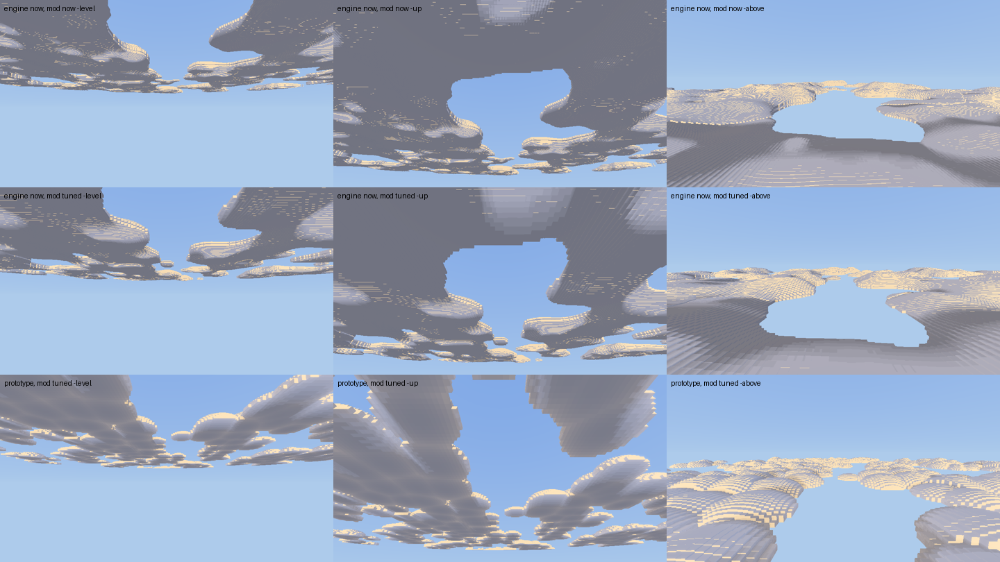

# Engine asks from Tiamot Weather

From the `tiamot_weather` mod (repo `Tiamot_Default_Weather`, beside the
engine checkout). Kept here, in the engine's `docs/engine-asks/`, so the
engine agent finds every mod's asks in one place and they are versioned with
the engine. Pictures and patches an ask cites are in `tiamot_weather/` beside
this file.

Numbered W*n*, continuing the weather sheet: W1–W9 were filed in that repo's
`docs/engine-asks-weather.md` and all of them are built or answered. That
file stays as the history. Each entry says what was seen, why the mod cannot
fix it, and the smallest engine change that would. Newest first. Items are
removed when they land.

## W12. Clouds cost too much at the horizon, and read as noise rather than cloud (2026-09-18)

**Seen, in game, by the designer.** "Far too high resolution, especially
towards the horizon, and so it's killing the FPS." And: "They don't look very
cloud-like yet, just kind of like a noise pattern running through the sky.
They need flatter bottoms and more bulbous tops." And a request: a fake
dot-product subsurface scattering, so they look fluffy. They are fine with
lower-resolution clouds.

**Evidence.** Rendered through `crates/client/tests/screenshot.rs`'s own
harness (a temporary ignored test, since removed), 960 x 540, Beautiful,
Normal quality, deck base 400 over the camera, cover 0.55:



Top row: engine 370eeac with Weather's old deck. Middle: the same engine
with Weather's new, coarser deck (cell 16, 2 octaves, 1/500, towers 0.2).
Bottom: the prototype below, with the same deck. Columns: level at the
horizon, 30 degrees up, and from 240 blocks above the deck.

Frame time added by the deck over a bare sky, ms:

| | level | up | above the deck |
|---|---|---|---|
| engine now, old deck (cell 8) | 0.65 | 0.78 | 2.86 |
| engine now, new deck (cell 16) | 0.30 | 0.35 | 1.15 |
| prototype, new deck (cell 16) | 0.76 | 1.18 | 3.85 |

Weather has already moved to the coarse deck, which is the whole of what a
mod can do about cost. The prototype's numbers are a first cut and are
mostly its 3 x 3 point search per column; see the shape section.

### 1. Cost: the grid coarsens too late, and is decided once per ray

`march` grows the cell until one covers `3.0` pixels, measured at `t_enter`,
and then keeps that cell for the whole ray. A ray at the horizon enters the
slab near and leaves it kilometres away, so it walks hundreds of fine cells
through air it can only see as a pixel or two, each one evaluating the
field. And Normal draws at full resolution (`resolution_scale` 1.0).

**Smallest changes, any one of which helps:**

- **Coarsen as the ray goes**, not only at entry: when `t` passes the
  distance where the current cell drops under the pixel target, double it
  (re-seat the DDA on the coarser grid). Powers of two keep neighbouring
  rays on the same grid, as now.
- **A larger target than 3 pixels**, 6 to 8. The prototype ran at 6 and
  nothing visible was lost at 960 x 540.
- **Half resolution for Normal**, with a depth-aware upsample, or at least a
  choice. `resolution_scale` says crisp edges are worth full resolution;
  this designer, on this machine, says they are not.
- **Skip the rind and anvil fbm where they cannot apply.** `column_at`
  computes the rind's fbm even when `detail_mix` is 0, which is most of the
  march's length at the horizon.

### 2. Shape: flat bottoms, domed tops, separate heaps

Today `column_at` thresholds an fbm and reads it as a height map:

- the underside is `base + lift` with `lift = thickness * 0.18 * (1 -
  strength)`, and the rind is subtracted from it, so every underside is a
  stack of terraces following the field's contours. That is the "noise
  pattern" from below, which is where players see the deck from;
- the top is `base + thickness * (0.25 + 0.55 * strength)`: linear in the
  field, so plateaus and ramps, never a dome;
- one continuous thresholded field makes continents with holes, not clouds.

**What the prototype does** (`tiamot_weather/cloud-prototype-2026-09-18.patch`
beside this file, against `clouds.wgsl` at 370eeac; a sketch to measure against, not a patch
to merge):

- **Heaps.** Points jittered on a grid in field space, one heap each. The
  coverage field is read AT THE POINT, so a heap is kept or dropped whole
  and is always round; `cover` still moves the threshold, and stronger
  coverage makes bigger heaps. Each heap is a hemisphere, `sqrt(1 - d^2)`,
  which rises steeply at the rim and rounds over the crown: bulbous.
- **A flat base.** The lower interval starts at `base`, always. The rind
  only ever raises a top.
- **Cauliflower** as a second, smaller scale of hemispheres on the crowns,
  faded by `detail_mix`.
- **Towers** as a random share of heaps grown taller, rather than a second
  interval floating over a gap (the gap made shelves that also read as
  noise).
- `Column` gains `density`, 0 at a heap's rim to 1 at its crown, for the
  lighting below.

Its cost is the 3 x 3 neighbourhood per column (nine hashes and a value
noise each). A 2 x 2 search with the radius capped under half the spacing,
or a precomputed heap texture sampled once, should bring it under today's
fbm.

### 3. Lighting: a fake subsurface scattering

The unlit side is one flat `shade`, which is what makes the undersides read
as solid. In the prototype, both cheap:

- **Wrapped diffuse**: `sunward = (facing + 0.6) / 1.6` instead of
  `facing * 0.5 + 0.5` squared, so light reaches round a heap rather than
  stopping at its terminator.
- **Transmission through thin cloud**: `scatter = (1 - density) * (0.25 +
  0.75 * pow(max(dot(view, to_sun), 0), 3)) + 0.12`, added as `colour * sun
  * scatter * 0.55`. Rims and the edges of heaps glow, most when the sun is
  behind them, and every side gets a little. The prototype re-reads the
  column for `density`; the march already has it and could return it in
  `Hit`.

**Acceptance.** The level and upward views from the ground show separate
heaps with flat, level bases and no terracing; from above, round crowns.
Looking at the horizon, the deck adds no more than today's coarse deck does
(0.30 ms in the harness above), and Normal never costs more than it does now.

## W11. Cloud shadows on the ground (deferred from W2, 2026-09-18)

**Seen.** The deck drifts overhead, but the ground under a cloud is lit
exactly as the ground under clear sky. A patch of shade moving over a
hillside is most of what makes a drifting sky read as drifting from the
ground, and it is in the designer's references (`docs/reference/` in the
weather repo).

**Why the mod cannot.** The deck is marched on the client from a field the
mod never sees, and the sunlight on terrain is the client's own. The mod has
no per-pixel say in either.

**Smallest change.** In the terrain pass, one sample of the same cloud field
along the sun direction from each lit fragment, darkening the sun term by the
deck's density there. Mode 1 can skip it, as it skips other lighting.

**Deferred by agreement** when W2 was built. Filed here so it is not lost;
it is lower priority than W10 and W12.

## W10. A storm on the horizon: a coarse cover map (deferred from W2, 2026-09-18)

**Seen.** `set_clouds(player, { cover, darkness })` sets one cover for the
whole sky a player sees. A storm over the next valley cannot be seen from the
clear valley beside it: the deck is either overcast everywhere or nowhere,
from that player's point of view. Rain at a distance is a curtain of dark
cloud kilometres away, and `set_precipitation` spawns only around the camera,
so this is the only way a player can watch a front coming.

**Why the mod cannot.** The mod knows the weather over every 256-block square
(`controller.lua`), but `set_clouds` takes a single number per player.

**Smallest change.** Let `set_clouds` take an optional coarse grid of cover
and darkness around the player, which the client samples in the march instead
of the single value:

```lua
game.set_clouds(uuid, {
    cover = 0.55, darkness = 0.0,        -- still the value outside the grid
    map = {
        origin = { x = x0, z = z0 },     -- world blocks, the grid's corner
        cell = 256,                      -- blocks per cell (Weather's square)
        size = 16,                       -- 16 x 16 cells: 4 km on a side
        cover = { ... },                 -- size*size numbers, row-major by z
        darkness = { ... },
    },
    ease_ticks = 600,
})
```

Sent on change like everything else. Weather would recentre the grid on
the player's square, which changes once a player crosses 256 blocks, and fill
it from the squares it already evaluates.

**Acceptance.** Standing under a clear square with a forced storm three
squares east, the east horizon shows a grey deck and the sky overhead does
not.
